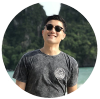

AI Engineer (Apprentice) @ AI Singapore | Aspiring AI/ML Engineer 

I always had an unexplained interest towards coding. Back in my early career days, I was trying to automate everyday workflows while using Excel VBA to free up my time. I was one of the beneficiaries of my own code, and I wanted to do more. Gradually, I moved on to MOOCs to broaden my skillsets and Andrew Ng was my companion for the weekends. And I can still remember clearly, the first time I printed "Hello World" with Python on my computer.

My journey towards a career in Data Science has just started and I am more inspired than ever to solve everyday propblems that matter with modern technology. Coming from a non-technical background, I know first hand that picking up coding can be tough. Hopefully through this blog and my AI/ML learnings, I can empower others to do the same. Feel free to reach out if you have any questions or comments about my posts!
